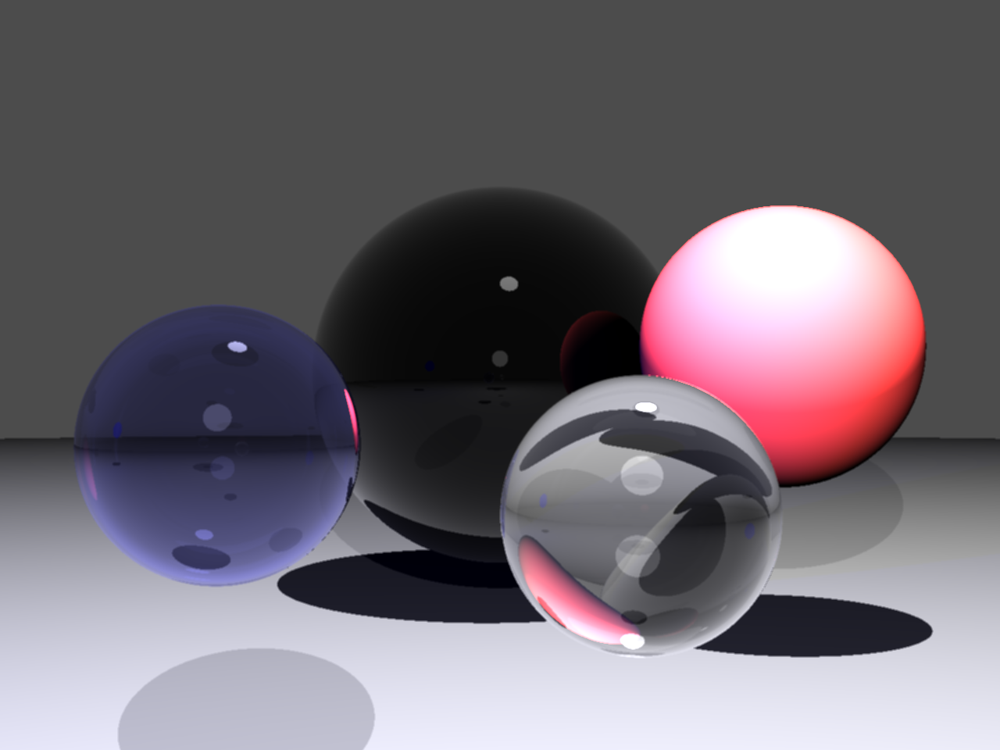

## raytracer.py

A basic raytracer that will render you a fancy spherific demo scene via
`python3 main.py`. Guess what, it's slow! One could speed things up by using
numpy and doing other nifty optimizations... However this project was meant to
get to know Python - not to create a state-of-the-art-super-pathtracer - instead just
use C++ and be fine. Or check out [Minilight](http://www.hxa.name/minilight/) -
a beautiful GI path tracer (keep in mind: Python won't get faster ^^).
Nevertheless, if you want to improve sth (e.g. fix the super-sampling)... feel
free to do so :sweat_smile:.

